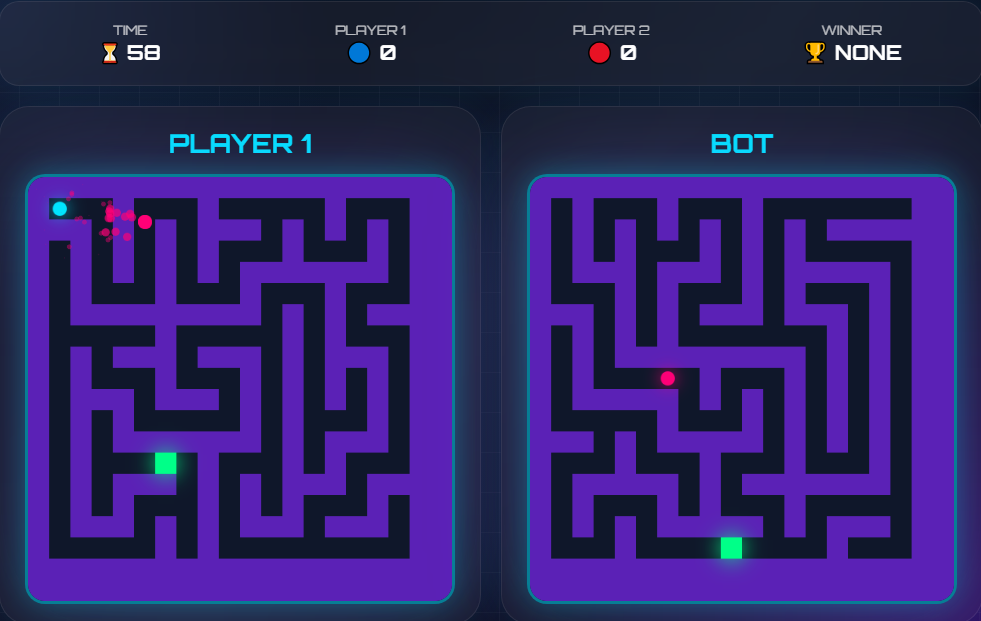

# 🌀 Cyber Maze Duel X

**Cyber Maze Duel X** is a modern, web-based maze game built with HTML, CSS, and JavaScript. Featuring an intelligent Bot opponent, live statistics, and a responsive cyber-themed interface, the game delivers a fast-paced and exciting maze-solving experience for players of all skill levels.

Whether you want to race against a friend or compete with a smart Bot, **Cyber Maze Duel X** offers smooth gameplay, dynamic challenges, and engaging mechanics.

---

# ✨ Features

## 🕹️ Local Multiplayer

Challenge your friends on the same device and compete to reach the finish line first.

## 🤖 Intelligent Bot

Play against an intelligent Bot opponent capable of navigating the maze and providing a competitive challenge.

## 📊 Live Statistics

Monitor your gameplay with real-time statistics, including:

- Wins
- Total Matches
- Match Duration

## 🎨 Modern UI/UX

Enjoy a futuristic cyber-style interface featuring:

- Smooth animations
- Responsive layout
- Neon visual effects
- distracting shadow animations
- Mobile-friendly experience
- Clean and intuitive controls

## ⚡ Fast Performance

Optimized JavaScript logic ensures smooth gameplay and responsive controls across desktop and mobile browsers.

---

# 📸 Preview

<div align="center">
  <a href="https://mfs-portfoliouz.netlify.app/portfolio1/projects">
    
  </a>
  <p><i>Click to watch the demo on my portfolio</i></p>
</div>
---

# 🛠️ Built With

| Technology | Purpose |
|------------|----------|
| HTML5 | Structure & Semantic Layout |
| CSS3 | Styling, Responsive Design & Animations |
| JavaScript (ES6+) | Game Logic |

---

# 🚀 Getting Started

## Clone the Repository

```bash
git clone [https://github.com/muxriddin-web/Labirint]
```

---

## Navigate into the Project

```bash
cd Labirint
```

---

## Run the Game

Simply open:

```text
index.html
```

in your favorite browser.

No installation or server setup required.

---

# 🎮 Game Controls

| Action | Description |
|--------|-------------|
| Arrow Keys / WASD | Move the player |
| Reach the Exit | Complete the maze |
| Multiplayer | Race against a friend |
| Bot Mode | Challenge the intelligent bot |
| Restart | Generate and play a new maze |

---

# 🤖 Bot Features

The built-in Bot includes:

- Intelligent pathfinding
- Fast route calculation
- Dynamic decision making
- Competitive gameplay
- Smooth movement

Future versions will introduce multiple Bot difficulty levels.

---

# 📊 Statistics System

The game keeps track of:

- ✅ Wins
- ⭐ Total Score
- 🎮 Total Play Time

---

# 📱 Responsive Design

Fully optimized for:

- 💻 Desktop
- 💼 Laptop
- 📱 Mobile
- 📟 Tablet

---

# 🌟 Future Roadmap

- [ ] 🌐 Online Multiplayer
- [ ] 💾 Save Match History
- [ ] 🎚️ AI Difficulty Levels
- [ ] 🔊 Sound Effects
- [ ] 🎵 Background Music
- [ ] 🎨 Multiple Themes
- [ ] 📈 Leaderboard
- [ ] 🔥 Achievement System
- [ ] ☁️ Cloud Save
- [ ] 🌍 Multi-language Support

---

# 📂 Project Structure

```text
cyber-maze-duel-x/
│
├── index.html
├── style.css
├── script.js
│
├── assets/
│   ├── images/
│   ├── icons/
│   └── sounds/
│
├── README.md
└── LICENSE
```

---

# 🤝 Contributing

Contributions are always welcome!

Fork the repository.

Create your feature branch.

```bash
git checkout -b feature/AmazingFeature
```

Commit your changes.

```bash
git commit -m "Add AmazingFeature"
```

Push to GitHub.

```bash
git push origin feature/AmazingFeature
```

Open a Pull Request.

---

# 📝 License

This project is distributed under the **MIT License**.

See the **LICENSE** file for more information.

---

# 📬 Contact

If you have questions, suggestions, or feedback, feel free to reach out.

### Project Repository

```text
https://github.com/muxriddin-web/Labirint
```

### Author

**Muxriddin O'tkirov**

### GitHub

```text
https://github.com/muxriddin-web
```

---

# ⭐ Support

If you like this project, don't forget to give it a ⭐ on GitHub!

It helps the project grow and motivates future development.

---

# 💡 Quote

> **"Every maze has a way out. Find it before your opponent does."**

---

## ❤️ Made with HTML, CSS & JavaScript
